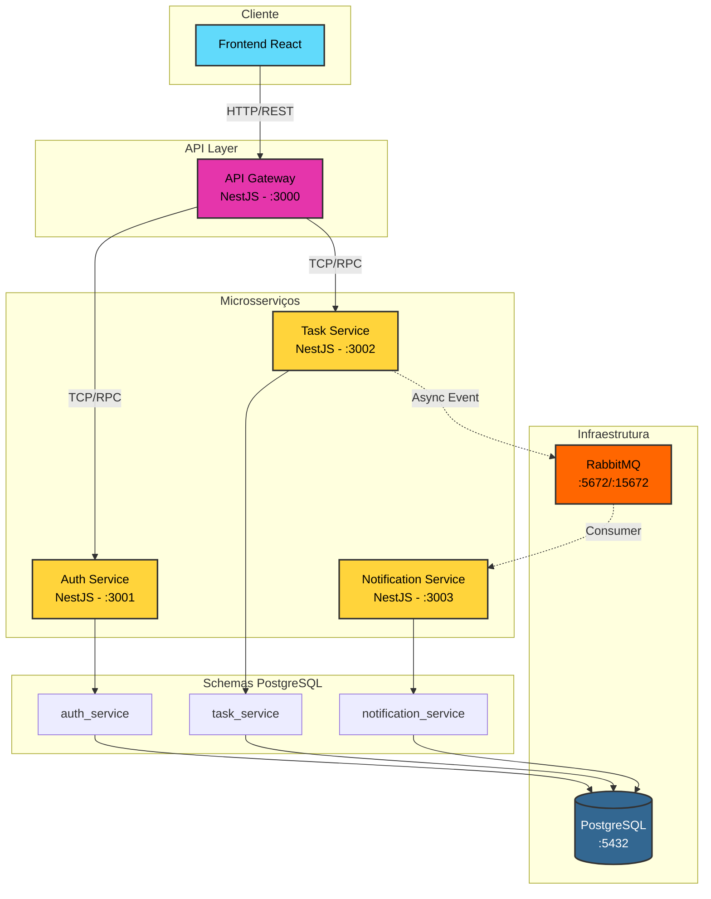
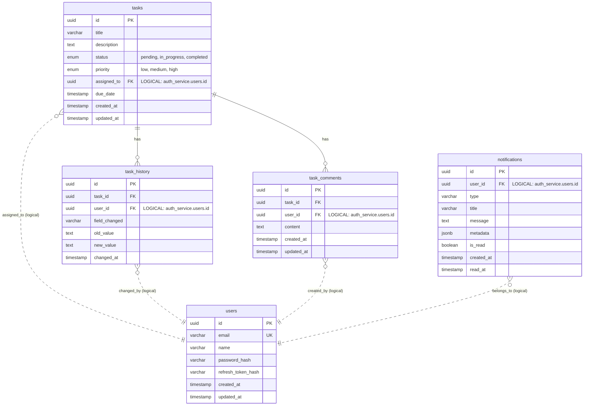

<div align="center">

# 🗂️ Kanban Microservices Platform

**Sistema de Gerenciamento de Tarefas com Arquitetura Distribuída**

[](https://nestjs.com/)
[](https://www.typescriptlang.org/)
[](https://react.dev/)
[](https://www.postgresql.org/)
[](https://www.rabbitmq.com/)
[](https://www.docker.com/)
[](https://turbo.build/)

<br/>

_Uma aplicação fullstack que demonstra padrões de arquitetura distribuída, comunicação híbrida entre serviços (TCP/RPC + Event-Driven), e práticas modernas de engenharia de software._

[Arquitetura](#-arquitetura-do-sistema) •
[Decisões Técnicas](#-decisões-de-engenharia--trade-offs) •
[Quick Start](#-quick-start) •
[API Docs](http://localhost:3001/api/docs)

</div>

---

## 📋 Visão Geral

Este projeto implementa um **Sistema Kanban** utilizando arquitetura de microsserviços, projetado para demonstrar:

- **Comunicação Híbrida**: Combinação estratégica de RPC síncrono (TCP) para operações críticas e mensageria assíncrona (RabbitMQ) para eventos
- **Isolamento de Domínios**: Cada serviço possui seu próprio schema de banco de dados, simulando databases separados
- **Event-Driven Architecture**: Notificações em tempo real via WebSocket, disparadas por eventos de domínio
- **Developer Experience**: Setup zero-config com Docker Compose, migrations automáticas e health checks

---

## 🏗️ Arquitetura do Sistema

### Visão de Alto Nível



### Padrões de Comunicação

| Fluxo                | Protocolo | Padrão           | Justificativa                           |
| -------------------- | --------- | ---------------- | --------------------------------------- |
| Frontend → Gateway   | HTTP/REST | Request-Response | Compatibilidade com browsers            |
| Gateway → Auth/Task  | TCP/RPC   | Request-Response | Baixa latência para operações síncronas |
| Task → Notifications | RabbitMQ  | Pub/Sub          | Desacoplamento e resiliência            |

---

### Modelo de Dados (ER Diagram)



> **Nota sobre Cross-Schema References**: As foreign keys entre schemas são **referências lógicas** (via UUID), não constraints físicas. Esta decisão mantém o desacoplamento entre microsserviços, simulando o cenário de produção onde cada serviço teria seu próprio database.

---

## ⚡ Features Técnicas

### Backend

| Feature                     | Implementação                             | Benefício                                                   |
| --------------------------- | ----------------------------------------- | ----------------------------------------------------------- |
| **API Gateway Pattern**     | NestJS com proxy TCP                      | Single entry point, centralização de concerns cross-cutting |
| **Audit Trail**             | `task_history` com triggers de domínio    | Rastreabilidade completa de alterações                      |
| **JWT + Refresh Tokens**    | Access token (15min) + Refresh token (7d) | Segurança com UX balanceada                                 |
| **Real-time Notifications** | Socket.io + RabbitMQ consumers            | Push notifications sem polling                              |
| **Schema Isolation**        | PostgreSQL schemas por serviço            | Bounded contexts com isolamento de dados                    |

### Frontend

| Feature                | Implementação            | Benefício                               |
| ---------------------- | ------------------------ | --------------------------------------- |
| **Optimistic Updates** | TanStack Query mutations | UX responsiva                           |
| **Drag & Drop Kanban** | @dnd-kit                 | Interação natural de board              |
| **Type Safety E2E**    | Shared `types` package   | Contratos unificados backend ↔ frontend |

### DevOps

| Feature               | Implementação                  | Benefício                       |
| --------------------- | ------------------------------ | ------------------------------- |
| **Zero-Config Setup** | Docker Compose + health checks | `docker compose up` e pronto    |
| **Auto Migrations**   | TypeORM migrations no startup  | Database sempre sincronizado    |
| **Monorepo**          | Turborepo                      | Build caching, dependency graph |

---

## 🧠 Decisões de Engenharia & Trade-offs

Esta seção documenta as principais decisões arquiteturais, demonstrando o processo de análise de trade-offs aplicado durante o desenvolvimento.

---

### 1. Arquitetura de Comunicação Híbrida

<table>
<tr>
<td width="50%">

**🎯 Problema**

Microsserviços precisam se comunicar. A escolha de um único protocolo (HTTP, gRPC, ou mensageria) força trade-offs em todos os cenários de uso.

</td>
<td width="50%">

**💡 Solução**

Adoção de comunicação híbrida:

- **TCP/RPC** para operações síncronas (auth, CRUD)
- **RabbitMQ** para eventos assíncronos (notificações)

</td>
</tr>
</table>

**Análise de Trade-offs:**

| Aspecto         | Impacto                                              |
| --------------- | ---------------------------------------------------- |
| ✅ Performance  | TCP elimina overhead HTTP em chamadas internas       |
| ✅ Resiliência  | Mensageria garante entrega mesmo com serviço offline |
| ✅ UX           | Operações críticas retornam imediatamente            |
| ⚠️ Complexidade | Dois protocolos = mais pontos de configuração        |

---

### 2. Isolamento de Dados via PostgreSQL Schemas

<table>
<tr>
<td width="50%">

**🎯 Problema**

A teoria de microsserviços preconiza "um database por serviço". Porém, rodar 3+ instâncias de PostgreSQL localmente consome recursos excessivos e complica o setup.

</td>
<td width="50%">

**💡 Solução**

Uma única instância PostgreSQL com **schemas isolados** (`auth_service`, `task_service`, `notification_service`). Cada serviço acessa exclusivamente seu schema.

</td>
</tr>
</table>

**Análise de Trade-offs:**

| Aspecto        | Impacto                                           |
| -------------- | ------------------------------------------------- |
| ✅ Recursos    | ~70% menos consumo de RAM vs múltiplas instâncias |
| ✅ Operacional | Setup simplificado para desenvolvimento           |
| ✅ Isolamento  | Schemas garantem separação lógica de dados        |
| ⚠️ SPOF        | Single point of failure (mitigável em produção)   |

> **Nota de Produção**: Em ambiente de produção, cada serviço teria seu próprio database instance, eliminando o SPOF. A arquitetura atual facilita esta migração sem alterações de código.

---

### 3. Orquestração de Startup com Health Checks

<table>
<tr>
<td width="50%">

**🎯 Problema**

Race conditions clássicas: aplicação tenta conectar antes do banco/broker estarem prontos. Resultado: crashes no startup, necessidade de restarts manuais.

</td>
<td width="50%">

**💡 Solução**

- Health checks nativos no Docker Compose
- `depends_on: service_healthy` para ordenação
- Migrations automáticas no entrypoint

</td>
</tr>
</table>

**Análise de Trade-offs:**

| Aspecto           | Impacto                                     |
| ----------------- | ------------------------------------------- |
| ✅ DX             | Comando único: `docker compose up`          |
| ✅ Confiabilidade | Zero race conditions no startup             |
| ✅ Consistência   | Database sempre na versão correta           |
| ⚠️ Cold Start     | ~15-30s adicionais aguardando health checks |

---

## 📁 Estrutura do Monorepo

```
kanban-microservices/
│
├── apps/                                    # Aplicações deployáveis
│   ├── api-gateway/                         # 🚪 Entry point HTTP
│   │   └── src/
│   │       ├── common/filters/              # Exception filters (RPC → HTTP)
│   │       └── [modules]/                   # Controllers por domínio
│   │
│   ├── auth-service/                        # 🔐 Autenticação & Usuários
│   │   ├── db/migrations/                   # Migrations do schema auth_service
│   │   └── src/auth/                        # JWT, bcrypt, refresh tokens
│   │
│   ├── tasks-service/                       # 📋 Core Domain
│   │   ├── db/migrations/                   # Migrations do schema task_service
│   │   └── src/
│   │       ├── task/                        # CRUD + Event publishing
│   │       ├── history/                     # Audit trail
│   │       └── comment/                     # Task comments
│   │
│   ├── notifications-service/               # 🔔 Event Consumer
│   │   └── src/
│   │       ├── notifications.gateway.ts     # WebSocket (Socket.io)
│   │       └── notifications/               # RabbitMQ consumers
│   │
│   └── web/                                 # ⚛️ Frontend SPA
│       └── src/
│           ├── components/                  # UI Components (Shadcn)
│           ├── hooks/                       # React Query + WebSocket
│           ├── services/                    # API Layer (Axios)
│           └── pages/                       # Route components
│
├── packages/                                # Bibliotecas compartilhadas
│   ├── types/                               # 📦 DTOs, Enums, Interfaces
│   │   ├── dto/                             # Data Transfer Objects
│   │   └── payloads/                        # Event payloads (RabbitMQ/JWT)
│   ├── exceptions/                          # Standardized error handling
│   └── eslint-config/                       # Shared linting rules
│
├── scripts/
│   └── seed.ts                              # Database seeding
│
├── docker-compose.yml                       # Infrastructure orchestration
└── turbo.json                               # Monorepo build pipeline
```

---

## 🚀 Quick Start

### Pré-requisitos

- Docker & Docker Compose v2+
- Node.js 18+ _(opcional, para desenvolvimento local)_

### Executando o Projeto

```bash
# Clone o repositório
git clone <repository-url>
cd kanban-microservices

# Suba toda a stack
docker compose up -d --build

# Aguarde os health checks (30-60s no primeiro build)
docker compose logs -f
```

### Acessos

| Serviço                 | URL                            | Credenciais   |
| ----------------------- | ------------------------------ | ------------- |
| **Frontend**            | http://localhost:5173          | —             |
| **API Docs (Swagger)**  | http://localhost:3001/api/docs | —             |
| **RabbitMQ Management** | http://localhost:15672         | admin / admin |

### Seed de Dados (Opcional)

```bash
# Com os containers rodando
npm install && npm run seed
```

---

## 📚 Tech Stack

| Camada        | Tecnologias                                            |
| ------------- | ------------------------------------------------------ |
| **Backend**   | NestJS, TypeScript, TypeORM, class-validator           |
| **Frontend**  | React 18, Vite, TailwindCSS, TanStack Query, Shadcn/UI |
| **Database**  | PostgreSQL 15                                          |
| **Messaging** | RabbitMQ 3.12                                          |
| **Infra**     | Docker, Docker Compose, Turborepo                      |
| **Testing**   | Jest, React Testing Library                            |

---

## 🗺️ Roadmap & Melhorias Futuras

### Melhorias de Resiliência

- [ ] **Dead Letter Exchanges (DLX)** — Isolamento de poison messages no RabbitMQ
- [ ] **Circuit Breaker** — Padrão via `opossum` nas chamadas TCP do Gateway
- [ ] **Retry Policies** — Exponential backoff para consumers

### Melhorias de Segurança

- [ ] **Session Management (Redis)** — Token blacklist e revogação imediata
- [ ] **Rate Limiting** — Throttling no API Gateway

### Melhorias de Observabilidade

- [ ] **Distributed Tracing** — OpenTelemetry + Jaeger
- [ ] **Structured Logging** — Correlação de logs entre serviços
- [ ] **Metrics** — Prometheus + Grafana dashboards

### Melhorias de Consistência

- [ ] **Optimistic Locking** — `@VersionColumn` para operações concorrentes
- [ ] **Contract Testing** — Pact ou similar para validar contratos entre serviços

---

## 🐛 Troubleshooting

<details>
<summary><strong>Erro: "Port already in use"</strong></summary>

Verifique se as portas `3000`, `3001`, `3002`, `3003`, `5173`, `5432` e `5672` estão livres.

```bash
docker compose down -v
lsof -i :3000  # Identifica processo na porta
```

</details>

<details>
<summary><strong>Containers reiniciando em loop</strong></summary>

Geralmente indica que o PostgreSQL ou RabbitMQ ainda não passou no health check. Aguarde ~60s ou verifique os logs:

```bash
docker compose logs postgres rabbitmq
```

</details>

<details>
<summary><strong>Migrations não executaram</strong></summary>

Execute manualmente:

```bash
docker compose exec auth-service npm run migration:run
docker compose exec tasks-service npm run migration:run
```

</details>

---

<div align="center">

**Desenvolvido com ☕ e boas práticas de engenharia**

[](https://linkedin.com/in/thiago-gritti)
[](https://github.com/thiagoDOTjpeg)

</div>
